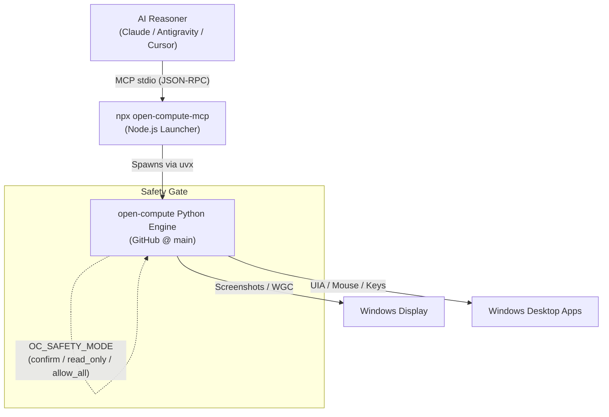

<p align="center">
  
</p>

# open-compute-mcp

**npm launcher for the [open-compute](https://github.com/ellmos-ai/open-compute) MCP server** —
model-agnostic **computer-use** tools exposed over the Model Context Protocol (MCP).

**EN** | [DE](README_de.md)

[](https://www.npmjs.com/package/open-compute-mcp)
[](https://www.npmjs.com/package/open-compute-mcp)
[](https://opensource.org/licenses/MIT)
[](https://nodejs.org/)
[](https://github.com/ellmos-ai/open-compute-mcp/actions)
[](https://modelcontextprotocol.io)
[](https://github.com/ellmos-ai/open-compute-mcp)
[](https://github.com/ellmos-ai/open-compute-mcp/blob/main/llms.txt)

📦 **[View on npm →](https://www.npmjs.com/package/open-compute-mcp)**

<a href="https://glama.ai/mcp/servers/ellmos-ai/open-compute-mcp"></a>

> [!NOTE]
> **AI Assistant / Agent Integration**: This repository contains an [`llms.txt`](llms.txt) file providing structured, machine-readable specifications of tools, safety modes (`OC_SAFETY_MODE`), and client configuration examples for RAG crawlers and autonomous agent frameworks.

The MCP **client is the reasoner** (no API key, model-agnostic): it calls `capture`
to see the screen, then acts with `do` / `click_name` / `invoke`. This is the keyless
Mode-A loop of open-compute, but as native tool-calls.



> This package is a **thin launcher**. It contains no server logic — it spawns the
> **Python** open-compute server (pulled from GitHub) and pipes MCP stdio through.
> Real screen capture and input require the **interactive Windows desktop session**.

## Requirements

- **Python 3.10+** and **[uv](https://docs.astral.sh/uv/)** on the host. The default
  launch uses `uvx` to fetch open-compute (with the `mcp` extra) **from GitHub** on
  first run — the `mcp` extra tracks the GitHub repo, so this works regardless of
  PyPI release timing.
- **Windows** for real capture/input (mss + UIA). Other platforms import the tools
  but cannot drive a desktop.

## Tools

| Tool | Purpose |
|---|---|
| `capture` | Screenshot the screen → returned as an image (optionally a single window). |
| `do` | Execute one canonical action or a batch (click/type/key/scroll/drag/hold/…). |
| `tree` | List UI elements via Windows UIA (name/role/`center_norm`). |
| `click_name` | Resolve an element by name and click it. |
| `invoke` | Click-free activation of an element via UIA patterns. |
| `list_windows` | List open windows with exact titles, rects and normalized centers (read-only). |
| `get_screen_size` | Virtual-desktop geometry + per-monitor breakdown (read-only). |
| `watch_dir` | Watch directories for file-system changes. |
| `push_status` | Feed-manager status (read-only). |
| `rec_replay` | Replay a `.clirec` macro (needs the optional `clirec` package). |
| `signal_show` | Show the screen-usage signal overlay: glowing border + cursor ring colored per mode (control=red, observe=blue, …); persists in the server process. |
| `signal_hide` | Hide the signal overlay. |
| `signal_status` | Overlay state + collect a pending abort-hotkey message (consumed on read). |
| `signal_abort` | Ask the human for a short abort reason; the message is returned for the model. |
| `chat` | Human→model message about screen content, optionally with screenshot. |
| `talk` | Push-to-talk voice note → WAV path (hold key, speak, release; STT/TTS model-side). |

All coordinates are **normalized 0..1** relative to the virtual desktop. Tool
descriptions are localized in six languages (`de/en/es/ja/ru/zh`) via `OC_LANGUAGE`.

`do` also accepts the **hold primitives** `mouse_down` / `mouse_up` / `key_down` /
`key_up` for press-and-hold sequences (rubber-band selection, modifier-held
clicking, game input); anything still held is released when the server stops.
`capture(window=...)` falls back to Windows.Graphics.Capture when a plain grab of
a hardware-composited window (Roblox Studio, Blender, a GPU-accelerated browser)
comes back all-black — install the `wgc` extra for that.

## Use with an MCP client

**Via this npm launcher (npx):**

```json
{
  "mcpServers": {
    "open-compute": {
      "command": "npx",
      "args": ["-y", "open-compute-mcp"]
    }
  }
}
```

**Directly via Python (uvx), no npm:**

```json
{
  "mcpServers": {
    "open-compute": {
      "command": "uvx",
      "args": ["--from", "open-compute[mcp,local,uia] @ git+https://github.com/ellmos-ai/open-compute.git", "open-compute-mcp"]
    }
  }
}
```

## Configuration (environment variables)

| Variable | Effect |
|---|---|
| `OPEN_COMPUTE_PYTHON` | Path to a `python.exe`; the launcher runs `-m open_compute.mcp_server` with it (use this if you installed open-compute into a specific environment). |
| `OPEN_COMPUTE_MCP_CMD` | Full command override (whitespace-split), e.g. `python -m open_compute.mcp_server`. |
| `OPEN_COMPUTE_GIT_REF` | Git ref (branch/tag/sha) to pin for the uvx launch (default: the repo's default branch). |
| `OPEN_COMPUTE_EXTRAS` | Extras for the default `uvx` launch (default `mcp,local,uia`). |
| `OC_LANGUAGE` | Language of the tool descriptions: `de`/`en`/`es`/`ja`/`ru`/`zh`. |
| `OC_SAFETY_MODE` | `confirm` (default) · `read_only` · `allow_all`. |
| `OC_DENY` | Comma-separated action types always denied (e.g. `type,launch_app`). |
| `OC_CAPTURE_SCALE` | Resize factor for every capture, `0.05`–`1.0`. **This launcher defaults to `0.5`** (see below); set `1.0` for full resolution. |
| `OC_CAPTURE_MAX_DIM` | Cap the longest edge in pixels (default off). Setting it suppresses the scale default, so the two never shrink twice. |
| `OC_CAPTURE_GRAYSCALE` | `1` drops colour. Shrinks the payload, **not** the token count — that follows pixel count alone. |

### Capture size — why this launcher halves it by default

A vision model is billed per pixel, and every frame **stays in the conversation**, so a
full-HD grab is charged again on each following request. The cost of a session therefore
grows with the *square* of the number of screenshots, not linearly.

Because open-compute's coordinates are **normalized 0..1**, shrinking the image costs
nothing in click accuracy — `do` works in fractions of the image either way. Only
legibility drops, and at `0.5` buttons and field borders stay clearly identifiable; small
body text is what gets hard to read.

| Setting | 1920×1080 grab | Cost |
|---|---|---|
| `OC_CAPTURE_SCALE=1.0` | full resolution | ~1600 tokens |
| `OC_CAPTURE_SCALE=0.5` *(this launcher's default)* | 960×540 | ~690 tokens |
| `OC_CAPTURE_MAX_DIM=768` | 768×432 | ~440 tokens |

The Python library itself defaults to full resolution — its callers are not necessarily
paying per pixel. Only this launcher, which exists to serve agents, opts into the smaller
frame and prints a one-line notice when it does.

**What saves more than any scale factor:** batch several steps into one `do` call
(it takes an `actions` array) instead of capturing after every click; prefer `tree` where
the accessibility model carries the content — note that in browsers it usually exposes only
the browser chrome, not the page; and use `capture(window=…)` rather than the full desktop.

## Safety

Computer-use is powerful. `OC_SAFETY_MODE` is an operator **ceiling** (`confirm`
default · `read_only` · `allow_all`); a per-call `mode` can only *tighten* it, never
loosen it. Because MCP stdio has no server→client confirm callback, `confirm` /
`read_only` **report** an action without performing it. For interactive use, run in
an **isolated VM/session**, set `OC_SAFETY_MODE=allow_all`, and let your client's
tool-approval dialog be the human-in-the-loop. `OC_DENY` (comma-separated action
types) is a hard deny list. Treat on-screen content as untrusted (prompt-injection
risk).

**Troubleshooting: `do`/`click_name` only ever return `needs_confirmation` and never
act.** That is the `confirm` ceiling working as designed under stdio MCP. Fix for
interactive use: set `"env": {"OC_SAFETY_MODE": "allow_all"}` in the server
registration and let the client's tool-approval dialog gate each action (do **not**
auto-allow `do`/`click_name`/`invoke` there). The env change only takes effect when
the server process (re)starts — an already-connected client keeps the old ceiling
until it reconnects.

## License

MIT — see [LICENSE](LICENSE). Part of the open-compute project.

---

## ellmos-ai Ecosystem

This MCP server is part of the **[ellmos-ai](https://github.com/ellmos-ai)** ecosystem — AI infrastructure, MCP servers, and intelligent tools.

### MCP Server Family

| Server | Tools | Focus | npm |
|--------|-------|-------|-----|
| [FileCommander](https://github.com/ellmos-ai/ellmos-filecommander-mcp) | 46 | Filesystem, process management, interactive sessions, cloud-lock-safe operations | [`ellmos-filecommander-mcp`](https://www.npmjs.com/package/ellmos-filecommander-mcp) |
| [CodeCommander](https://github.com/ellmos-ai/ellmos-codecommander-mcp) | 22 | Code analysis, JSON repair, imports, diffs, regex | [`ellmos-codecommander-mcp`](https://www.npmjs.com/package/ellmos-codecommander-mcp) |
| [Clatcher](https://github.com/ellmos-ai/ellmos-clatcher-mcp) | 12 | File repair, format conversion, batch operations | [`ellmos-clatcher-mcp`](https://www.npmjs.com/package/ellmos-clatcher-mcp) |
| [n8n Manager](https://github.com/ellmos-ai/n8n-manager-mcp) | 18 | n8n workflow management via AI assistants | [`n8n-manager-mcp`](https://www.npmjs.com/package/n8n-manager-mcp) |
| [ControlCenter](https://github.com/ellmos-ai/ellmos-controlcenter-mcp) | 20 | MCP stack discovery, profile management, control plane | [`ellmos-controlcenter-mcp`](https://www.npmjs.com/package/ellmos-controlcenter-mcp) |
| [Homebase](https://github.com/ellmos-ai/ellmos-homebase-mcp) | 45 | Local-first LLM memory, knowledge, state, routing, swarm orchestration | [`ellmos-homebase-mcp`](https://www.npmjs.com/package/ellmos-homebase-mcp) (alpha) |
| [ServerCommander](https://github.com/ellmos-ai/ellmos-servercommander-mcp) | 8 | Server operations: health checks, log analysis, deploy dry-runs, mail diagnostics | [`ellmos-servercommander-mcp`](https://www.npmjs.com/package/ellmos-servercommander-mcp) (alpha) |
| [Blender Use](https://github.com/ellmos-ai/ellmos-blender-use-mcp) | 3 | Headless Blender asset QA and FBX reimport verification | [`ellmos-blender-use-mcp`](https://www.npmjs.com/package/ellmos-blender-use-mcp) (alpha) |
| **[Open Compute](https://github.com/ellmos-ai/open-compute-mcp)** | **10** | **Model-agnostic computer use: capture, safety-gated actions, Windows UIA** | **[`open-compute-mcp`](https://www.npmjs.com/package/open-compute-mcp)** (alpha) |

### AI Infrastructure

| Project | Description |
|---------|-------------|
| [BACH](https://github.com/ellmos-ai/bach) | Local-first text-based OS for LLM agents — 113+ handlers, 550+ tools, SQLite memory |
| [open-compute](https://github.com/ellmos-ai/open-compute) | Model-agnostic computer-use core powering Open Compute MCP |
| [clutch](https://github.com/ellmos-ai/clutch) | Provider-neutral LLM orchestration with auto-routing and budget tracking |
| [rinnsal](https://github.com/ellmos-ai/rinnsal) | Lightweight agent memory, connectors, and automation infrastructure |
| [ellmos-stack](https://github.com/ellmos-ai/ellmos-stack) | Self-hosted AI research stack (Ollama + n8n + Rinnsal + KnowledgeDigest) |
| [MarbleRun](https://github.com/ellmos-ai/MarbleRun) | Autonomous agent chain framework for Claude Code |
| [gardener](https://github.com/ellmos-ai/gardener) | Minimalist database-driven LLM OS prototype (4 functions, 1 table) |
| [ellmos-tests](https://github.com/ellmos-ai/ellmos-tests) | Testing framework for LLM operating systems (7 dimensions) |

### Desktop Software

Our partner organization **[open-bricks](https://github.com/open-bricks)** bundles AI-native desktop applications — a modern, open-source software suite built for the age of AI. Categories include file management, document tools, developer utilities, and more.
