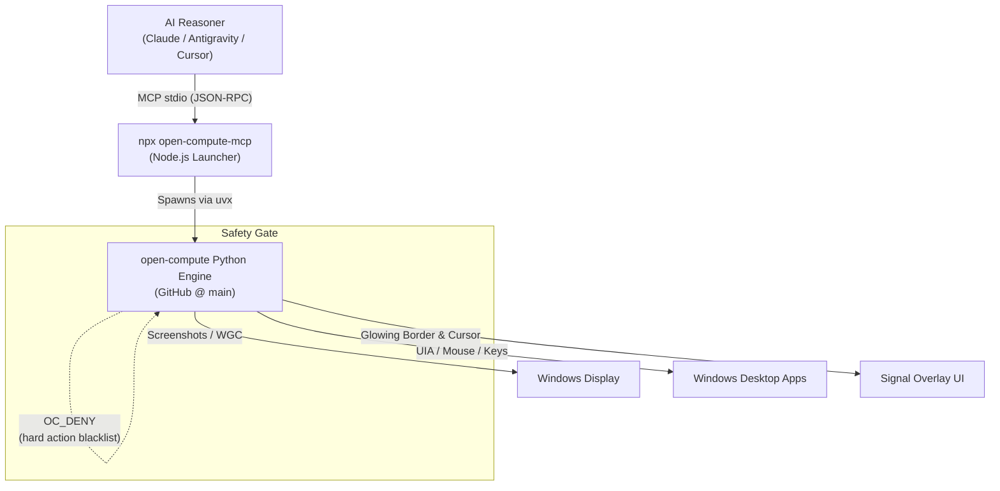
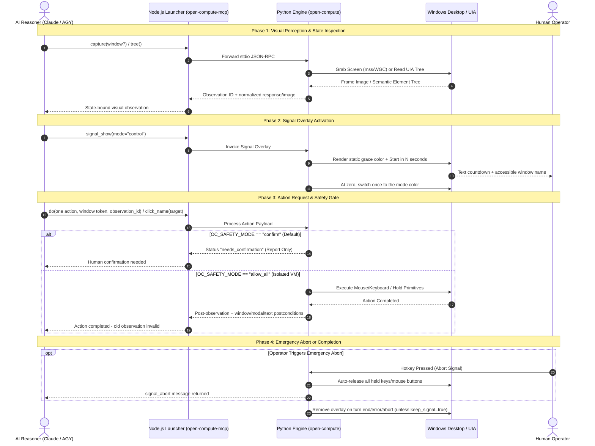

<p align="center">
  
</p>

# open-compute-mcp

**npm launcher for the [open-compute](https://github.com/ellmos-ai/open-compute) MCP server** —
model-agnostic **computer-use** tools exposed over the Model Context Protocol (MCP).

> [!IMPORTANT]
> **Local stdio only.** Real capture and input require an interactive Windows
> desktop session on the MCP client's own host. This launcher is **not Glama-hostable**;
> a hosted "Deploy Server" flow cannot access your desktop.
> Install it in a local MCP client instead.

**EN** | [DE](README_de.md)

[](https://github.com/ellmos-ai/open-compute-mcp/actions/workflows/ci.yml)
[](https://www.npmjs.com/package/open-compute-mcp)
[](https://www.npmjs.com/package/open-compute-mcp)
[](https://github.com/ellmos-ai/open-compute-mcp)
[](LICENSE)
[](https://nodejs.org/)
[](test)
[](https://prettier.io)
[](SECURITY.md)
[](https://modelcontextprotocol.io)
[](https://github.com/ellmos-ai/open-compute-mcp)
[](SECURITY.md)
[](SECURITY.md)
[](THIRD_PARTY_LICENSES.md)
[](MARKETING-LOG.txt)
[](llms.txt)
[](https://github.com/ellmos-ai)
[](https://github.com/open-bricks)
[](https://github.com/ellmos-ai/open-compute-mcp/blob/main/llms.txt)

📦 **[View on npm →](https://www.npmjs.com/package/open-compute-mcp)** • 📋 **[Security Policy](SECURITY.md)** • ⚖️ **[Licenses](THIRD_PARTY_LICENSES.md)** • 🤖 **[LLM Context (llms.txt)](llms.txt)**

---

### Quick Navigation

- [✨ Key Capabilities](#key-capabilities)
- [🏗️ Architecture](#architecture)
- [🛠️ Tools (16)](#tools)
- [🚀 Use with an MCP Client](#use-with-an-mcp-client)
- [🎯 Target Personas & Discoverability](#target-personas--discoverability)
- [📊 Comparative Matrix vs. Alternatives](#comparative-matrix-vs-alternatives)
- [🔄 Safe Interaction & Signal Lifecycle](#safe-interaction--signal-lifecycle)
- [⚙️ Configuration](#configuration-environment-variables)
- [🔒 Safety & Security](#safety)
- [🏛️ Governance & Runtime Invariants](#governance--runtime-invariants)
- [🧪 Testing & Verification](#testing--verification)
- [🛡️ Security Policy & SLAs](SECURITY.md)
- [⚖️ Third-Party Licenses](THIRD_PARTY_LICENSES.md)
- [📜 Marketing & Maintenance Log](MARKETING-LOG.txt)
- [🤖 LLM Context](llms.txt)
- [🌐 ellmos-ai Ecosystem & Sibling Matrix](#ellmos-ai-ecosystem)

---

> [!NOTE]
> **AI Assistant / Agent Integration**: This repository contains an [`llms.txt`](llms.txt) file providing structured, machine-readable specifications of tools, safety modes (`OC_SAFETY_MODE`), and client configuration examples for RAG crawlers and autonomous agent frameworks.

The MCP **client is the reasoner** (no API key, model-agnostic): it calls `capture`
to see the screen, then acts with `do` / `click_name` / `invoke`. This is the keyless
Mode-A loop of open-compute, but as native tool-calls.

## Key Capabilities

1. **State-bound Perception & Window Targeting:** Captures/trees return one-shot observation IDs; window enumeration returns stable window/process IDs and issued tokens. WGC remains the GPU-window fallback.
2. **Fail-closed Action Execution:** Coordinates consume one observation and exact window binding; UIA names resolve exact-first; text is segmented with focus checks and character-count postconditions.
3. **Leased Signal Overlay & Abort Control:** The glowing border/cursor signal has owner/session metadata, a bounded TTL, turn-end cleanup, and immediate human abort.
4. **Multimodal Collaboration & Voice Notes:** Push-to-talk voice recording (`talk`), screen chat messaging (`chat`), directory monitoring (`watch_dir`), and macro replay (`rec_replay`).

## Architecture



> This package is a **thin launcher**. It contains no server logic — it spawns the
> **Python** open-compute server (pulled from GitHub) and pipes MCP stdio through.
> Real screen capture and input require the **interactive Windows desktop session**.

## Requirements

- **Python 3.10+** and **[uv](https://docs.astral.sh/uv/)** on the host. The default
  launch uses `uvx` to fetch open-compute (with the `mcp` extra) **from GitHub** on
  first run — the `mcp` extra tracks the GitHub repo, so this works regardless of
  PyPI release timing.
- **Windows** for real capture/input (mss + UIA). Other platforms import the tools
  but cannot drive a desktop.

## Tools

| Tool | Purpose |
|---|---|
| `capture` | Return one-shot observation metadata plus an image (optionally one exact window). |
| `do` | Execute a safety-gated action; coordinates require `observation_id` + issued window descriptor/token. |
| `tree` | Return UIA elements and a one-shot observation ID for their coordinates. |
| `click_name` | Exact-first, ambiguity-safe click in a required issued window, with score/alternatives. |
| `invoke` | Exact-first, click-free UIA activation in a required issued window. |
| `list_windows` | List stable window/process IDs, exact titles, issued tokens, rects and centers. |
| `get_screen_size` | Virtual-desktop geometry + per-monitor breakdown (read-only). |
| `watch_dir` | Watch directories for file-system changes. |
| `push_status` | Feed-manager status (read-only). |
| `rec_replay` | Replay a `.clirec` macro (needs the optional `clirec` package). |
| `signal_show` | Show a configurable pre-action color/text countdown, then the mode-colored overlay, with owner/session lease and bounded TTL. |
| `signal_hide` | Hide the signal overlay. |
| `signal_status` | Owner/session/mode/visible/expires_at + pending abort message. |
| `signal_abort` | Ask the human for a short abort reason; the message is returned for the model. |
| `chat` | Human→model message about screen content, optionally with screenshot. |
| `talk` | Push-to-talk voice note → WAV path (hold key, speak, release; STT/TTS model-side). |

All coordinates are **normalized 0..1** relative to the virtual desktop. Tool
descriptions are localized in six languages (`de/en/es/ja/ru/zh`) via `OC_LANGUAGE`.

`do` also accepts the **hold primitives** `mouse_down` / `mouse_up` / `key_down` /
`key_up` for press-and-hold sequences (rubber-band selection, modifier-held
clicking, game input); anything still held is released when the server stops.
`capture(window=...)` falls back to Windows.Graphics.Capture when a plain grab of
a hardware-composited window (Roblox Studio, Blender, a GPU-accelerated browser)
comes back all-black — install the `wgc` extra for that.

## Safe Interaction & Signal Lifecycle

The v0.8 Python engine enforces observe → one action → automatic refresh. Keep
the full descriptor or `window_token` from `list_windows`, then pass it as
`expected_window` together with the latest `observation_id` from `capture` or
`tree`. `click_name`/`invoke` require that issued window too. Reuse, changed
state, focus mismatch, covered windows, and ambiguous UIA targets are rejected
before input. `type` returns requested/sent character
counts and complete/partial status without echoing the text. Signals have a
hard TTL and are removed at action turn end unless `keep_signal=true`.

An explicit `signal_show` starts the engine's configured pre-action grace
period. The static grace color is distinct from the mode color and the visible
text counts down `Start in N Sekunden` once per second. At zero, both phase and
color switch once to active. `signal_status` exposes the same phase, remaining
seconds, current color, and screenreader label. Duration, grace color, and text
template come from `OC_SIGNAL_GRACE_SECONDS` / `OC_SIGNAL_CONFIG`; `0` skips the
countdown. The design uses no flashing, pulsing, or motion animation.



## Use with an MCP client

**Via this npm launcher (npx):**

```json
{
  "mcpServers": {
    "open-compute": {
      "command": "npx",
      "args": ["-y", "open-compute-mcp"]
    }
  }
}
```

**Directly via Python (uvx), no npm:**

```json
{
  "mcpServers": {
    "open-compute": {
      "command": "uvx",
      "args": ["--from", "open-compute[mcp,local,uia] @ git+https://github.com/ellmos-ai/open-compute.git", "open-compute-mcp"]
    }
  }
}
```

<a id="target-personas--discoverability"></a>
## Target Personas & Discoverability

`open-compute-mcp` is architected for four technical personas across autonomous AI operations, system engineering, accessibility assurance, and multimodal human-in-the-loop workflows:

| Target Persona | Core Operational Needs | Pain Points Solved | Target Discovery Terms |
| :--- | :--- | :--- | :--- |
| **Autonomous AI Agents & Swarms** *(Claude Code, Antigravity, Cursor, Windsurf)* | Reliable desktop perception, normalized coordinates (0..1), state-bound observation tokens | Stale-frame hallucination; blind multi-action execution; coordination drift across agent turns | `open-compute-mcp`, `computer-use mcp server`, `claude desktop computer use`, `agent desktop automation mcp` |
| **Enterprise AI Safety & SecOps Teams** | Fail-closed operator safety ceiling (`OC_SAFETY_MODE`), action denylists, zero network egress | Runaway autonomous agents; remote cloud telemetry leakage; unverified privilege escalation | `safe computer-use mcp`, `zero-egress gui automation`, `operator ceiling ai agent`, `runasinvoker desktop mcp` |
| **Windows GUI QA & Accessibility Engineers** | Semantic element targeting via UI Automation (UIA), click-free activation, exact-first matching | Fragile optical/OCR coordinate clicking; broken resolution scaling; brittle UI test automation | `windows uia mcp server`, `semantic ui automation mcp`, `accessibility tree gui testing`, `exact-first uia click` |
| **Multimodal Human-in-the-Loop Operators** | Leased visual signal overlay with countdown, emergency human abort hotkey, push-to-talk voice/chat | Silent background tampering; inability to stop runaway models; disjointed human-agent feedback loops | `signal overlay mcp`, `push-to-talk ai assistant`, `human-in-the-loop desktop agent`, `emergency abort computer use` |

### High-Intent Search Term Matrix (SEO & Discoverability)

| Category | Primary Search Terms (English) | Primäre Suchbegriffe (Deutsch) |
|---|---|---|
| **MCP & Agent Tooling** | `model context protocol computer use`, `open compute mcp launcher`, `claude desktop gui automation` | `Model Context Protocol Computer Use`, `Open Compute MCP Server`, `Claude Desktop GUI Steuerung` |
| **UI Automation & Targeting** | `windows uia accessibility tree mcp`, `exact-first ui element targeting`, `semantic desktop automation` | `Windows UI Automation MCP`, `Semantische Desktop Steuerung`, `Barrierefreiheitsbaum Element Targeting` |
| **Safety & Governance** | `fail-closed agent safety ceiling`, `zero-egress desktop mcp`, `runasinvoker unprivileged agent` | `Fail-Closed Agenten Sicherheit`, `Zero-Egress Desktop Automatisierung`, `Unprivilegierte Agentenausführung` |
| **Visual Signals & Feedback** | `leased screen signal overlay`, `emergency abort hotkey computer use`, `push-to-talk voice note mcp` | `Visuelles Signal Overlay Bildschirm`, `Notfallabbruch Hotkey Computer Use`, `Push-to-Talk Sprachnachricht MCP` |

<a id="comparative-matrix-vs-alternatives"></a>
## Comparative Matrix vs. Alternatives

`open-compute-mcp` delivers a model-agnostic, safety-bounded bridge between LLM reasoners and the Windows desktop environment. The following matrix illustrates how `open-compute-mcp` compares with alternative desktop interaction patterns across 10 operational dimensions:

| Evaluation Dimension | `open-compute-mcp` | Direct OS Shell (PowerShell/Win32) | Proprietary Cloud Computer-Use | Heavyweight Vision Frameworks (PyAutoGUI/Selenium) | Standard Ungated MCP Tools |
| :--- | :---: | :---: | :---: | :---: | :---: |
| **1. Primary Interface & Transport** | **PASS** (Model Context Protocol JSON-RPC over stdio) | ❌ Raw CLI / PowerShell stdio | ❌ Proprietary SaaS REST / WebSockets | ❌ Python scripts / ad-hoc bindings | ⚠️ Generic unstandardized stdio |
| **2. Safety Ceiling & Guardrails** | **PASS** (Enforced `OC_SAFETY_MODE` ceiling: confirm/read_only) | ❌ 0 guardrails (arbitrary code execution) | ⚠️ Opaque vendor-side moderation | ❌ 0 guardrails (direct OS API hooks) | ❌ Unchecked direct tool invocation |
| **3. State Binding & Observation Lifespan** | **PASS** (One-shot `observation_id` invalidated after 1 action) | ❌ Stateless; requires manual polling | ⚠️ Ephemeral cloud session state | ❌ Stale coordinate drift; no invalidation | ❌ No coordinate or frame binding |
| **4. Dual Targeting Precision** | **PASS** (Exact-first UIA + Normalized 0..1 vision coordinates) | ⚠️ HWND and Process ID lookups only | ⚠️ Pure vision pixel heuristics | ❌ Raw pixel coordinates / web DOM only | ❌ Parameter passing without UI tree |
| **5. Visual Signal & Countdown** | **PASS** (Leased glowing border, grace timer & screenreader label) | ❌ Invisible background activity | ⚠️ Browser/Dashboard canvas preview only | ❌ Silent cursor movements | ❌ No visual user notification |
| **6. Emergency Abort & Auto-Release** | **PASS** (Global hotkey abort + auto-release of all held keys/mouse) | ❌ Ctrl+C terminates but may leave keys stuck | ⚠️ Web UI disconnect button | ⚠️ Manual corner flick (keys often get stuck) | ❌ Client disconnect only |
| **7. Multimodal Feedback** | **PASS** (Built-in push-to-talk WAV recording & screen chat) | ❌ Text stdout/stderr only | ⚠️ Web chat textbox | ❌ None | ❌ JSON schema text only |
| **8. Token Economy Optimization** | **PASS** (0.5x default scale: ~690 tokens vs ~1600 tokens full HD) | N/A (no native vision capabilities) | ❌ Metered cloud token surcharges | ❌ Full-resolution uncompressed dumps | ⚠️ Variable uncompressed frame transfers |
| **9. Privacy & Zero-Egress** | **PASS** (100% offline, zero network telemetry: `INV-LOCAL-01`) | ⚠️ Local unless script calls external endpoints | ❌ Screen frames streamed to remote cloud | ⚠️ Telemetry packages often bundled | ⚠️ Dependent on backend transport |
| **10. Governance & Security SLA** | **PASS** (10 Invariants, 48h Security Response & 5d Triage SLA) | ❌ OS vendor lifecycle | ❌ Proprietary closed-source Terms of Service | ⚠️ Community best-effort maintenance | ⚠️ Heterogeneous author quality |

## Configuration (environment variables)

| Variable | Effect |
|---|---|
| `OPEN_COMPUTE_PYTHON` | Path to a `python.exe`; the launcher runs `-m open_compute.mcp_server` with it (use this if you installed open-compute into a specific environment). |
| `OPEN_COMPUTE_MCP_CMD` | Full command override (whitespace-split), e.g. `python -m open_compute.mcp_server`. |
| `OPEN_COMPUTE_GIT_REF` | Git ref (branch/tag/sha) to pin for the uvx launch (default: the repo's default branch). |
| `OPEN_COMPUTE_EXTRAS` | Extras for the default `uvx` launch (default `mcp,local,uia`). |
| `OC_LANGUAGE` | Language of the tool descriptions: `de`/`en`/`es`/`ja`/`ru`/`zh`. |
| `OC_SAFETY_MODE` | `confirm` (default) · `read_only` · `allow_all`. |
| `OC_DENY` | Comma-separated action types always denied (e.g. `type,launch_app`). |
| `OC_CAPTURE_SCALE` | Resize factor for every capture, `0.05`–`1.0`. **This launcher defaults to `0.5`** (see below); set `1.0` for full resolution. |
| `OC_CAPTURE_MAX_DIM` | Cap the longest edge in pixels (default off). Setting it suppresses the scale default, so the two never shrink twice. |
| `OC_CAPTURE_GRAYSCALE` | `1` drops colour. Shrinks the payload, **not** the token count — that follows pixel count alone. |
| `OC_SIGNAL_TTL` | Hard overlay lease limit in seconds (default 120). |
| `OC_SIGNAL_IDLE_HIDE` | Additional idle timeout for explicitly kept auto-signals (default 60). |
| `OC_SIGNAL_GRACE_SECONDS` | Pre-action countdown duration (default 20; `0` starts immediately). |
| `OC_SIGNAL_CONFIG` | Signal JSON containing `pre_action_grace_color`, `pre_action_grace_label`, and per-mode colors. |

### Capture size — why this launcher halves it by default

A vision model is billed per pixel, and every frame **stays in the conversation**, so a
full-HD grab is charged again on each following request. The cost of a session therefore
grows with the *square* of the number of screenshots, not linearly.

Because open-compute's coordinates are **normalized 0..1**, shrinking the image costs
nothing in click accuracy — `do` works in fractions of the image either way. Only
legibility drops, and at `0.5` buttons and field borders stay clearly identifiable; small
body text is what gets hard to read.

| Setting | 1920×1080 grab | Cost |
|---|---|---|
| `OC_CAPTURE_SCALE=1.0` | full resolution | ~1600 tokens |
| `OC_CAPTURE_SCALE=0.5` *(this launcher's default)* | 960×540 | ~690 tokens |
| `OC_CAPTURE_MAX_DIM=768` | 768×432 | ~440 tokens |

The Python library itself defaults to full resolution — its callers are not necessarily
paying per pixel. Only this launcher, which exists to serve agents, opts into the smaller
frame and prints a one-line notice when it does.

**What saves more than any scale factor:** prefer `tree` where
the accessibility model carries the content — note that in browsers it usually exposes only
the browser chrome, not the page; and use `capture(window=…)` rather than the full desktop.
Coordinate actions deliberately follow observe → one action → automatic refresh;
do not batch multiple coordinate steps against one stale frame.

## Safety

Computer-use is powerful. `OC_SAFETY_MODE` is an operator **ceiling** (`confirm`
default · `read_only` · `allow_all`); a per-call `mode` can only *tighten* it, never
loosen it. Because MCP stdio has no server→client confirm callback, `confirm` /
`read_only` **report** an action without performing it. For interactive use, run in
an **isolated VM/session**, set `OC_SAFETY_MODE=allow_all`, and let your client's
tool-approval dialog be the human-in-the-loop. `OC_DENY` (comma-separated action
types) is a hard deny list. Treat on-screen content as untrusted (prompt-injection
risk).

**Troubleshooting: `do`/`click_name` only ever return `needs_confirmation` and never
act.** That is the `confirm` ceiling working as designed under stdio MCP. Fix for
interactive use: set `"env": {"OC_SAFETY_MODE": "allow_all"}` in the server
registration and let the client's tool-approval dialog gate each action (do **not**
auto-allow `do`/`click_name`/`invoke` there). The env change only takes effect when
the server process (re)starts — an already-connected client keeps the old ceiling
until it reconnects.

## Governance & Runtime Invariants

| Invariant ID | Rule & Principle | Enforcement & Architectural Guarantee |
|---|---|---|
| `INV-LOCAL-01` | **Zero-Egress & Local Stdio** | All screen capture, mouse/keyboard automation, and signal overlays execute strictly locally over stdio JSON-RPC; 0 telemetry, 0 external analytics, 0 network transmissions. |
| `INV-GATE-02` | **Fail-Closed Safety Ceiling** | `OC_SAFETY_MODE` (default: `confirm`) acts as a hard operator ceiling; per-call parameters can only tighten the policy (`confirm`/`read_only`), never loosen it without environment restart in an isolated VM (`allow_all`). |
| `INV-OBS-03` | **One-Shot Observation Lifespan** | Every `capture` and `tree` call generates an ephemeral `observation_id`; coordinates consume exactly one observation and are invalidated immediately, preventing stale click execution. |
| `INV-WIN-04` | **Strict Window Binding** | Coordinate actions require verified `window_token` / window descriptor from `list_windows`; focus mismatch, covered/occluded windows, or ambiguous targets fail closed before input. |
| `INV-SIG-05` | **Leased Signal Overlay & Immediate Abort** | Visual signal overlay (`signal_show`) operates with owner/session lease, bounded TTL (default 120s), turn-end cleanup, and immediate emergency human abort via hotkey. |
| `INV-UIA-06` | **Exact-First Semantic Resolution** | `click_name` and `invoke` resolve exact semantic UIA matches first before fuzzy matching, returning scores and alternatives for transparency. |
| `INV-PROC-07` | **Unprivileged RunAsInvoker Mode** | Operates strictly with standard user privileges (`RunAsInvoker`); never requires or requests administrative elevation. |
| `INV-CROSS-08` | **Multi-OS Stdio Protocol Parity** | Strict Model Context Protocol (MCP) JSON-RPC adherence tested across Ubuntu, Windows, and macOS on Node.js 18.x, 20.x, 22.x, and 24.x. |
| `INV-SYNC-09` | **Multi-Agent Lock & Conflict Discipline** | Defensive file system ignore patterns and fail-closed lock checks prevent concurrent workspace pollution and protect cloud synchronization integrity. |
| `INV-SLA-10` | **48h Security Response & 5-Day Triage SLA** | Documented commitment to acknowledge vulnerability disclosures within 48 hours and deliver preliminary triage within 5 business days. |

## Testing & Verification

The test suite validates launcher functionality, repository hygiene, and metadata parity across manifests and documentation:

```bash
# Run all automated tests
npm test

# Run repository hygiene and secret leakage checks
npm run test:hygiene

# Verify packaging integrity
npm pack --dry-run
```

All pull requests and commits are verified through GitHub Actions CI (`.github/workflows/ci.yml`) with automated matrix builds on **Ubuntu**, **Windows**, and **macOS** across Node.js **18.x**, **20.x**, **22.x**, and **24.x**.

## License

MIT — see [LICENSE](LICENSE). Part of the open-compute project.

---

## ellmos-ai Ecosystem

This MCP server is part of the **[ellmos-ai](https://github.com/ellmos-ai)** ecosystem — AI infrastructure, MCP servers, and intelligent tools.

### MCP Server Family

| Server | Tools | Focus | npm |
|--------|-------|-------|-----|
| [FileCommander](https://github.com/ellmos-ai/ellmos-filecommander-mcp) | 46 | Filesystem, process management, interactive sessions, cloud-lock-safe operations | [`ellmos-filecommander-mcp`](https://www.npmjs.com/package/ellmos-filecommander-mcp) |
| [CodeCommander](https://github.com/ellmos-ai/ellmos-codecommander-mcp) | 22 | Code analysis, JSON repair, imports, diffs, regex | [`ellmos-codecommander-mcp`](https://www.npmjs.com/package/ellmos-codecommander-mcp) |
| [Clatcher](https://github.com/ellmos-ai/ellmos-clatcher-mcp) | 12 | File repair, format conversion, batch operations | [`ellmos-clatcher-mcp`](https://www.npmjs.com/package/ellmos-clatcher-mcp) |
| [n8n Manager](https://github.com/ellmos-ai/n8n-manager-mcp) | 18 | n8n workflow management via AI assistants | [`n8n-manager-mcp`](https://www.npmjs.com/package/n8n-manager-mcp) |
| [ControlCenter](https://github.com/ellmos-ai/ellmos-controlcenter-mcp) | 20 | MCP stack discovery, profile management, control plane | [`ellmos-controlcenter-mcp`](https://www.npmjs.com/package/ellmos-controlcenter-mcp) |
| [Homebase](https://github.com/ellmos-ai/ellmos-homebase-mcp) | 45 | Local-first LLM memory, knowledge, state, routing, swarm orchestration | [`ellmos-homebase-mcp`](https://www.npmjs.com/package/ellmos-homebase-mcp) (alpha) |
| [ServerCommander](https://github.com/ellmos-ai/ellmos-servercommander-mcp) | 8 | Server operations: health checks, log analysis, deploy dry-runs, mail diagnostics | [`ellmos-servercommander-mcp`](https://www.npmjs.com/package/ellmos-servercommander-mcp) (alpha) |
| [Blender Use](https://github.com/ellmos-ai/ellmos-blender-use-mcp) | 3 | Headless Blender asset QA and FBX reimport verification | [`ellmos-blender-use-mcp`](https://www.npmjs.com/package/ellmos-blender-use-mcp) (alpha) |
| **[Open Compute](https://github.com/ellmos-ai/open-compute-mcp)** | **16** | **Model-agnostic computer use: capture, safety-gated actions, Windows UIA, signal overlay & voice/chat** | **[`open-compute-mcp`](https://www.npmjs.com/package/open-compute-mcp)** (alpha) |

### AI Infrastructure & Sibling Tooling

| Project | Description |
|---|---|
| [BACH](https://github.com/ellmos-ai/bach) | Local-first text-based OS for LLM agents — 113+ handlers, 550+ tools, SQLite memory |
| [open-compute](https://github.com/ellmos-ai/open-compute) | Model-agnostic computer-use core powering Open Compute MCP |
| [clutch](https://github.com/ellmos-ai/clutch) | Provider-neutral LLM orchestration with auto-routing and budget tracking |
| [rinnsal](https://github.com/ellmos-ai/rinnsal) | Lightweight agent memory, connectors, and automation infrastructure |
| [ellmos-stack](https://github.com/ellmos-ai/ellmos-stack) | Self-hosted AI research stack (Ollama + n8n + Rinnsal + KnowledgeDigest) |
| [MarbleRun](https://github.com/ellmos-ai/MarbleRun) | Autonomous agent chain framework for Claude Code |
| [gardener](https://github.com/ellmos-ai/gardener) | Minimalist database-driven LLM OS prototype (4 functions, 1 table) |
| [ellmos-tests](https://github.com/ellmos-ai/ellmos-tests) | Testing framework for LLM operating systems (7 dimensions) |
| [sqlite-transit-sync](https://github.com/ellmos-ai/sqlite-transit-sync) | Safe, redacted, HMAC-verified SQLite snapshot synchronizer |
| [policy-registry](https://github.com/ellmos-ai/policy-registry) | Hierarchical policy & delegation authority engine |

### Open Bricks Umbrella

Our partner organization **[open-bricks](https://github.com/open-bricks)** bundles AI-native desktop applications — a modern, open-source software suite built for the age of AI. Sibling suites include [DevCenter](https://github.com/dev-bricks/DevCenter), [CodeBox](https://github.com/dev-bricks/CodeBox), [MethodenAnalyser](https://github.com/dev-bricks/MethodenAnalyser), [CleanMarkdown](https://github.com/doc-bricks/CleanMarkdown), and [PDFtoPDFocr](https://github.com/doc-bricks/PDFtoPDFocr).

