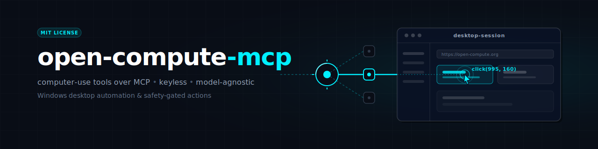

<p align="center">
  
</p>

# open-compute-mcp

**npm-Launcher für den [open-compute](https://github.com/ellmos-ai/open-compute) MCP-Server** —
modellagnostische **Computer-Use**-Tools über das Model Context Protocol (MCP).

**EN** ([README.md](README.md)) | **DE**

Der MCP-**Client ist der Reasoner** (kein API-Key, modellagnostisch): Er ruft `capture`
auf, um den Bildschirm zu sehen, und handelt dann mit `do` / `click_name` / `invoke`.
Das ist die schlüssellose Modus-A-Schleife von open-compute, aber als native Tool-Calls.

> Dieses Paket ist ein **dünner Launcher**. Es enthält keine Server-Logik — es startet
> den **Python**-Server (open-compute) **von GitHub** und reicht MCP-stdio durch. Echtes
> Capture/Input braucht die interaktive **Windows**-Desktop-Session.

## Voraussetzungen

- **Python 3.10+** und **[uv](https://docs.astral.sh/uv/)** auf dem Host (der Standard
  zieht open-compute per `uvx` von GitHub — open-compute liegt bewusst nicht auf PyPI).
- **Windows** für echtes Capture/Input (mss + UIA).

## Tools

| Tool | Zweck |
|---|---|
| `capture` | Screenshot des Bildschirms → als Bild (optional nur ein Fenster). |
| `do` | Eine kanonische Aktion oder einen Stapel ausführen (Klick/Tippen/Taste/Scroll/Drag). |
| `tree` | UI-Elemente eines Fensters via Windows-UIA auflisten (Name/Rolle/`center_norm`). |
| `click_name` | Element per Name auflösen und anklicken. |
| `invoke` | Klickfreie Aktivierung eines Elements via UIA-Muster. |
| `watch_dir` | Verzeichnisse auf Dateisystem-Änderungen überwachen. |
| `push_status` | Feed-Manager-Status (nur Lesen). |
| `rec_replay` | Ein `.clirec`-Makro abspielen (benötigt das optionale `clirec`-Paket). |

Alle Koordinaten sind **normiert 0..1** relativ zum virtuellen Desktop. Tool-Beschreibungen
sind in sechs Sprachen lokalisiert (`de/en/es/ja/ru/zh`) — wählbar über `OC_LANGUAGE`.

## Nutzung mit einem MCP-Client

**Über diesen npm-Launcher (npx):**

```json
{
  "mcpServers": {
    "open-compute": {
      "command": "npx",
      "args": ["-y", "open-compute-mcp"]
    }
  }
}
```

**Direkt über Python (uvx), ohne npm:**

```json
{
  "mcpServers": {
    "open-compute": {
      "command": "uvx",
      "args": ["--from", "open-compute[mcp,local,uia] @ git+https://github.com/ellmos-ai/open-compute.git", "open-compute-mcp"]
    }
  }
}
```

## Konfiguration (Umgebungsvariablen)

| Variable | Wirkung |
|---|---|
| `OPEN_COMPUTE_PYTHON` | Pfad zu einer `python.exe`; startet damit `-m open_compute.mcp_server`. |
| `OPEN_COMPUTE_MCP_CMD` | Voller Befehls-Override (per Leerzeichen getrennt). |
| `OPEN_COMPUTE_GIT_REF` | Git-Ref (Branch/Tag/SHA) zum Pinnen des uvx-Launch (Default: der Default-Branch des Repos). |
| `OPEN_COMPUTE_EXTRAS` | Extras für den uvx-Launch (Default `mcp,local,uia`). |
| `OC_LANGUAGE` | Sprache der Tool-Beschreibungen: `de`/`en`/`es`/`ja`/`ru`/`zh`. |
| `OC_SAFETY_MODE` | `confirm` (Default) · `read_only` · `allow_all`. |
| `OC_DENY` | Kommagetrennte Aktionstypen, die immer verweigert werden. |

## Sicherheit

Computer-Use ist mächtig. `OC_SAFETY_MODE` ist eine Operator-**Obergrenze** (`confirm`
Standard · `read_only` · `allow_all`); ein per-Call-`mode` kann sie nur *verschärfen*, nie
lockern. Da MCP-stdio keinen Server→Client-Confirm-Callback hat, **melden** `confirm`/
`read_only` eine Aktion, ohne sie auszuführen. Für interaktiven Betrieb in einer
**isolierten VM/Session** `OC_SAFETY_MODE=allow_all` setzen und den Tool-Berechtigungsdialog
des Clients als Human-in-the-Loop nutzen. `OC_DENY` ist eine harte Deny-Liste. Behandle
Bildschirminhalte als nicht vertrauenswürdig (Prompt-Injection-Risiko).

## Lizenz

MIT — siehe [LICENSE](LICENSE). Teil des open-compute-Projekts.
