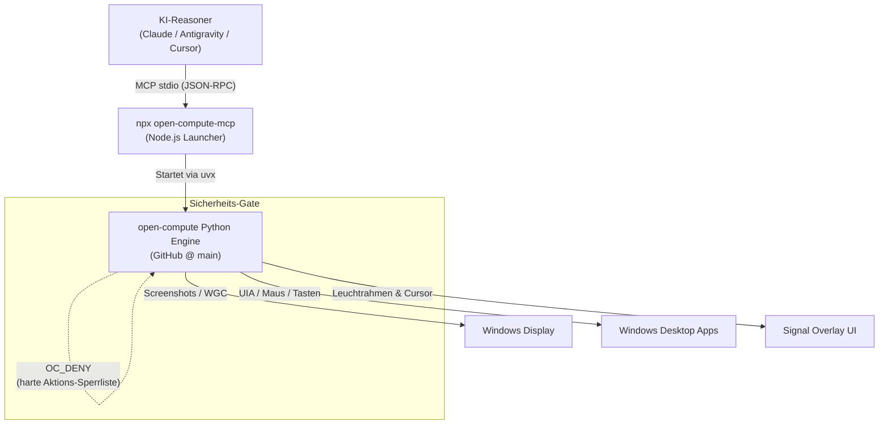
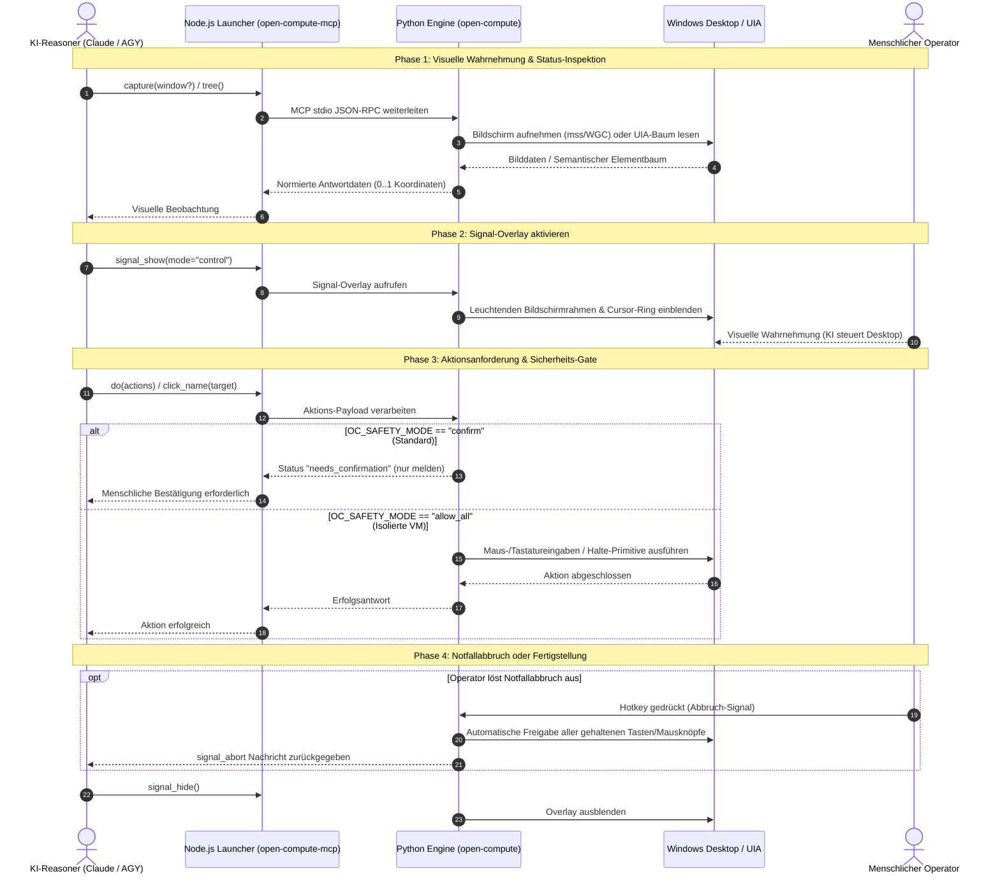

<p align="center">
  
</p>

# open-compute-mcp

**npm-Launcher für den [open-compute](https://github.com/ellmos-ai/open-compute) MCP-Server** —
modellagnostische **Computer-Use**-Tools über das Model Context Protocol (MCP).

**EN** ([README.md](README.md)) | **DE**

[](https://www.npmjs.com/package/open-compute-mcp)
[](https://www.npmjs.com/package/open-compute-mcp)
[](https://opensource.org/licenses/MIT)
[](https://nodejs.org/)
[](https://github.com/ellmos-ai/open-compute-mcp/actions)
[](https://modelcontextprotocol.io)
[](https://github.com/ellmos-ai/open-compute-mcp)
[](SECURITY.md)
[](SECURITY.md)
[](https://github.com/ellmos-ai)
[](https://github.com/open-bricks)
[](https://github.com/ellmos-ai/open-compute-mcp/blob/main/llms.txt)

📦 **[Auf npm ansehen →](https://www.npmjs.com/package/open-compute-mcp)** • 📋 **[Sicherheitsrichtlinie](SECURITY.md)** • 🤖 **[LLM-Kontext (llms.txt)](llms.txt)**

<a href="https://glama.ai/mcp/servers/ellmos-ai/open-compute-mcp"></a>

---

### Schnellnavigation

- [✨ Hauptfunktionen](#hauptfunktionen)
- [🏗️ Architektur](#architektur)
- [🛠️ Tools (16)](#tools)
- [🚀 Nutzung mit einem MCP-Client](#nutzung-mit-einem-mcp-client)
- [🔄 Sichere Interaktion & Signal-Lebenszyklus](#sichere-interaktion--signal-lebenszyklus)
- [⚙️ Konfiguration](#konfiguration-umgebungsvariablen)
- [🔒 Sicherheit & Leitplanken](#sicherheit)
- [🌐 ellmos-ai-Ökosystem](#ellmos-ai-ökosystem)

---

> [!NOTE]
> **KI-Assistenten / Agenten-Integration**: Dieses Repository enthält eine [`llms.txt`](llms.txt)-Datei mit strukturierten, maschinenlesbaren Spezifikationen der Tools, Sicherheitsmodi (`OC_SAFETY_MODE`) und Client-Konfigurationsbeispielen für RAG-Crawler und autonome Agenten-Frameworks.

Der MCP-**Client ist der Reasoner** (kein API-Key, modellagnostisch): Er ruft `capture`
auf, um den Bildschirm zu sehen, und handelt dann mit `do` / `click_name` / `invoke`.
Das ist die schlüssellose Modus-A-Schleife von open-compute, aber als native Tool-Calls.

## Hauptfunktionen

1. **Visuelle Wahrnehmung & Fenster-Targeting:** Vollbild- und Einzelfensteraufnahmen mit automatischem Windows.Graphics.Capture (WGC) Fallback für Hardware-komponierte GPU-Fenster (Blender, Roblox Studio, Browser).
2. **Safety-Gated Aktionsausführung:** Normierte 0..1-Koordinaten, strikte Operator-Obergrenze (`confirm` / `read_only` / `allow_all`), klickfreie UIA-Muster-Aktivierung und Halte-Primitive mit automatischem Release bei Abbruch.
3. **Visuelles Signal-Overlay & Abbruch-Steuerung:** Kontinuierliche visuelle Statusanzeige (leuchtender Bildschirmrahmen & farbiger Cursor-Ring) mit sofortigem Hotkey-Abbruch durch den Nutzer.
4. **Multimodale Kollaboration & Sprachnotizen:** Push-to-Talk-Sprachaufnahmen (`talk`), Chat-Nachrichten mit Bildschirmbezug (`chat`), Dateisystem-Überwachung (`watch_dir`) und Makro-Replay (`rec_replay`).

## Architektur


```mermaid
graph TD
    A["KI-Reasoner<br/>(Claude / Antigravity / Cursor)"] -- "MCP stdio (JSON-RPC)" --> B["npx open-compute-mcp<br/>(Node.js Launcher)"]
    B -- "Startet via uvx" --> C["open-compute Python Engine<br/>(GitHub @ main)"]
    C -- "Screenshots / WGC" --> D["Windows Display"]
    C -- "UIA / Maus / Tasten" --> E["Windows Desktop Apps"]
    C -- "Leuchtrahmen & Cursor" --> F["Signal Overlay UI"]

    subgraph Sicherheits-Gate
        C -. "OC_SAFETY_MODE<br/>(confirm / read_only / allow_all)" .-> C
        C -. "OC_DENY<br/>(harte Aktions-Sperrliste)" .-> C
    end
```

> Dieses Paket ist ein **dünner Launcher**. Es enthält keine Server-Logik — es startet
> den **Python**-Server (open-compute) **von GitHub** und reicht MCP-stdio durch. Echtes
> Capture/Input braucht die interaktive **Windows**-Desktop-Session.

## Voraussetzungen

- **Python 3.10+** und **[uv](https://docs.astral.sh/uv/)** auf dem Host (der Standard
  zieht open-compute per `uvx` von GitHub — open-compute liegt bewusst nicht auf PyPI).
- **Windows** für echtes Capture/Input (mss + UIA).

## Tools

| Tool | Zweck |
|---|---|
| `capture` | Screenshot des Bildschirms → als Bild (optional nur ein Fenster). |
| `do` | Eine kanonische Aktion oder einen Stapel ausführen (Klick/Tippen/Taste/Scroll/Drag/Halten). |
| `tree` | UI-Elemente eines Fensters via Windows-UIA auflisten (Name/Rolle/`center_norm`). |
| `click_name` | Element per Name auflösen und anklicken. |
| `invoke` | Klickfreie Aktivierung eines Elements via UIA-Muster. |
| `list_windows` | Offene Fenster mit exakten Titeln, Rechtecken und normierten Mittelpunkten (nur Lesen). |
| `get_screen_size` | Geometrie des virtuellen Desktops + Monitor-Aufschlüsselung (nur Lesen). |
| `watch_dir` | Verzeichnisse auf Dateisystem-Änderungen überwachen. |
| `push_status` | Feed-Manager-Status (nur Lesen). |
| `rec_replay` | Ein `.clirec`-Makro abspielen (benötigt das optionale `clirec`-Paket). |
| `signal_show` | Bildschirm-Signal-Overlay anzeigen: leuchtender Rahmen + Cursor-Ring, Farbe je Modus (control=rot, observe=blau, …); bleibt im Server-Prozess sichtbar. |
| `signal_hide` | Signal-Overlay ausblenden. |
| `signal_status` | Overlay-Zustand + ausstehende Abort-Hotkey-Nachricht abholen (wird beim Lesen verbraucht). |
| `signal_abort` | Kurzen Abbruchgrund beim Menschen erfragen; die Nachricht geht ans Modell. |
| `chat` | Mensch→Modell-Nachricht zum Bildschirminhalt, optional mit Screenshot. |
| `talk` | Push-to-Talk-Sprachnotiz → WAV-Pfad (Taste halten, sprechen, loslassen; STT/TTS modellseitig). |

Alle Koordinaten sind **normiert 0..1** relativ zum virtuellen Desktop. Tool-Beschreibungen
sind in sechs Sprachen lokalisiert (`de/en/es/ja/ru/zh`) — wählbar über `OC_LANGUAGE`.

`do` akzeptiert zusätzlich die **Halte-Primitive** `mouse_down` / `mouse_up` /
`key_down` / `key_up` für Drücken-und-Halten-Sequenzen (Auswahlrahmen aufziehen,
modifikator-gehaltenes Klicken, Spiele-Eingaben); alles noch Gedrückte wird beim
Beenden des Servers wieder losgelassen. `capture(window=...)` weicht auf
Windows.Graphics.Capture aus, wenn ein normaler Grab eines hardware-komponierten
Fensters (Roblox Studio, Blender, GPU-beschleunigter Browser) komplett schwarz
zurückkommt — dafür das `wgc`-Extra installieren.

## Sichere Interaktion & Signal-Lebenszyklus


```mermaid
sequenceDiagram
    autonumber
    actor Reasoner as KI-Reasoner (Claude / AGY)
    participant Launcher as Node.js Launcher (open-compute-mcp)
    participant Engine as Python Engine (open-compute)
    participant UI as Windows Desktop / UIA
    actor Operator as Menschlicher Operator

    Note over Reasoner,Operator: Phase 1: Visuelle Wahrnehmung & Status-Inspektion
    Reasoner->>Launcher: capture(window?) / tree()
    Launcher->>Engine: MCP stdio JSON-RPC weiterleiten
    Engine->>UI: Bildschirm aufnehmen (mss/WGC) oder UIA-Baum lesen
    UI-->>Engine: Bilddaten / Semantischer Elementbaum
    Engine-->>Launcher: Normierte Antwortdaten (0..1 Koordinaten)
    Launcher-->>Reasoner: Visuelle Beobachtung

    Note over Reasoner,Operator: Phase 2: Signal-Overlay aktivieren
    Reasoner->>Launcher: signal_show(mode="control")
    Launcher->>Engine: Signal-Overlay aufrufen
    Engine->>UI: Leuchtenden Bildschirmrahmen & Cursor-Ring einblenden
    Operator-->>UI: Visuelle Wahrnehmung (KI steuert Desktop)

    Note over Reasoner,Operator: Phase 3: Aktionsanforderung & Sicherheits-Gate
    Reasoner->>Launcher: do(actions) / click_name(target)
    Launcher->>Engine: Aktions-Payload verarbeiten
    alt OC_SAFETY_MODE == "confirm" (Standard)
        Engine-->>Launcher: Status "needs_confirmation" (nur melden)
        Launcher-->>Reasoner: Menschliche Bestätigung erforderlich
    else OC_SAFETY_MODE == "allow_all" (Isolierte VM)
        Engine->>UI: Maus-/Tastatureingaben / Halte-Primitive ausführen
        UI-->>Engine: Aktion abgeschlossen
        Engine-->>Launcher: Erfolgsantwort
        Launcher-->>Reasoner: Aktion erfolgreich
    end

    Note over Reasoner,Operator: Phase 4: Notfallabbruch oder Fertigstellung
    opt Operator löst Notfallabbruch aus
        Operator->>Engine: Hotkey gedrückt (Abbruch-Signal)
        Engine->>UI: Automatische Freigabe aller gehaltenen Tasten/Mausknöpfe
        Engine-->>Reasoner: signal_abort Nachricht zurückgegeben
    end
    Reasoner->>Launcher: signal_hide()
    Engine->>UI: Overlay ausblenden
```

## Nutzung mit einem MCP-Client

**Über diesen npm-Launcher (npx):**

```json
{
  "mcpServers": {
    "open-compute": {
      "command": "npx",
      "args": ["-y", "open-compute-mcp"]
    }
  }
}
```

**Direkt über Python (uvx), ohne npm:**

```json
{
  "mcpServers": {
    "open-compute": {
      "command": "uvx",
      "args": ["--from", "open-compute[mcp,local,uia] @ git+https://github.com/ellmos-ai/open-compute.git", "open-compute-mcp"]
    }
  }
}
```

## Konfiguration (Umgebungsvariablen)

| Variable | Wirkung |
|---|---|
| `OPEN_COMPUTE_PYTHON` | Pfad zu einer `python.exe`; startet damit `-m open_compute.mcp_server`. |
| `OPEN_COMPUTE_MCP_CMD` | Voller Befehls-Override (per Leerzeichen getrennt). |
| `OPEN_COMPUTE_GIT_REF` | Git-Ref (Branch/Tag/SHA) zum Pinnen des uvx-Launch (Default: der Default-Branch des Repos). |
| `OPEN_COMPUTE_EXTRAS` | Extras für den uvx-Launch (Default `mcp,local,uia`). |
| `OC_LANGUAGE` | Sprache der Tool-Beschreibungen: `de`/`en`/`es`/`ja`/`ru`/`zh`. |
| `OC_SAFETY_MODE` | `confirm` (Default) · `read_only` · `allow_all`. |
| `OC_DENY` | Kommagetrennte Aktionstypen, die immer verweigert werden. |
| `OC_CAPTURE_SCALE` | Skalierungsfaktor für jede Aufnahme, `0.05`–`1.0`. **Dieser Launcher setzt standardmäßig `0.5`** (siehe unten); `1.0` für volle Auflösung. |
| `OC_CAPTURE_MAX_DIM` | Längste Kante in Pixeln deckeln (Default aus). Wird sie gesetzt, entfällt der Skalierungs-Default — so wird nie doppelt verkleinert. |
| `OC_CAPTURE_GRAYSCALE` | `1` lässt die Farbe weg. Verkleinert die Datenmenge, **nicht** die Token-Zahl — die hängt allein an der Pixelzahl. |

### Aufnahmegröße — warum dieser Launcher standardmäßig halbiert

Ein Vision-Modell rechnet pro Pixel ab, und jedes Bild **bleibt im Gesprächsverlauf** — eine
Full-HD-Aufnahme wird also bei jeder weiteren Anfrage erneut bezahlt. Die Kosten einer
Sitzung wachsen deshalb im *Quadrat* der Screenshot-Zahl, nicht linear.

Da die Koordinaten in open-compute **normalisiert sind (0..1)**, kostet das Verkleinern
nichts an Klickgenauigkeit — `do` rechnet ohnehin in Bruchteilen des Bildes. Nur die
Lesbarkeit sinkt, und bei `0.5` bleiben Schaltflächen und Feldränder klar erkennbar;
schwierig wird allein kleiner Fließtext.

| Einstellung | Aufnahme 1920×1080 | Kosten |
|---|---|---|
| `OC_CAPTURE_SCALE=1.0` | volle Auflösung | ~1600 Token |
| `OC_CAPTURE_SCALE=0.5` *(Default dieses Launchers)* | 960×540 | ~690 Token |
| `OC_CAPTURE_MAX_DIM=768` | 768×432 | ~440 Token |

Die Python-Bibliothek selbst bleibt bei voller Auflösung — ihre Aufrufer zahlen nicht
zwangsläufig pro Pixel. Nur dieser Launcher, der ausschließlich Agenten bedient, wählt das
kleinere Bild und gibt beim Start eine einzeilige Notiz aus.

**Was mehr bringt als jeder Skalierungsfaktor:** mehrere Schritte in einem `do`-Aufruf
bündeln (er nimmt ein `actions`-Array) statt nach jedem Klick aufzunehmen; `tree` nutzen, wo
das Bedienhilfen-Modell den Inhalt trägt — in Browsern liefert es meist nur die
Browser-Oberfläche, nicht die Seite; und `capture(window=…)` statt des ganzen Desktops.

## Sicherheit

Computer-Use ist mächtig. `OC_SAFETY_MODE` ist eine Operator-**Obergrenze** (`confirm`
Standard · `read_only` · `allow_all`); ein per-Call-`mode` kann sie nur *verschärfen*, nie
lockern. Da MCP-stdio keinen Server→Client-Confirm-Callback hat, **melden** `confirm`/
`read_only` eine Aktion, ohne sie auszuführen. Für interaktiven Betrieb in einer
**isolierten VM/Session** `OC_SAFETY_MODE=allow_all` setzen und den Tool-Berechtigungsdialog
des Clients als Human-in-the-Loop nutzen. `OC_DENY` ist eine harte Deny-Liste. Behandle
Bildschirminhalte als nicht vertrauenswürdig (Prompt-Injection-Risiko).

**Troubleshooting: `do`/`click_name` liefern nur `needs_confirmation` und handeln
nie.** Das ist die `confirm`-Obergrenze, die unter stdio-MCP designgemäß so wirkt.
Fix für interaktiven Betrieb: `"env": {"OC_SAFETY_MODE": "allow_all"}` in der
Server-Registrierung setzen und jede Aktion durch den Tool-Berechtigungsdialog des
Clients gaten lassen (`do`/`click_name`/`invoke` dort **nicht** pauschal erlauben).
Die env-Änderung greift erst, wenn der Serverprozess neu startet — ein bereits
verbundener Client behält die alte Obergrenze bis zum Reconnect.

## Lizenz

MIT — siehe [LICENSE](LICENSE). Teil des open-compute-Projekts.

---

## ellmos-ai-Ökosystem

Dieser MCP-Server ist Teil des **[ellmos-ai](https://github.com/ellmos-ai)**-Ökosystems — KI-Infrastruktur, MCP-Server und intelligente Werkzeuge.

### MCP-Server-Familie

| Server | Tools | Fokus | npm |
|--------|-------|-------|-----|
| [FileCommander](https://github.com/ellmos-ai/ellmos-filecommander-mcp) | 46 | Dateisystem, Prozessverwaltung, interaktive Sitzungen, Cloud-Lock-sichere Operationen | [`ellmos-filecommander-mcp`](https://www.npmjs.com/package/ellmos-filecommander-mcp) |
| [CodeCommander](https://github.com/ellmos-ai/ellmos-codecommander-mcp) | 22 | Code-Analyse, JSON-Reparatur, Imports, Diffs, Regex | [`ellmos-codecommander-mcp`](https://www.npmjs.com/package/ellmos-codecommander-mcp) |
| [Clatcher](https://github.com/ellmos-ai/ellmos-clatcher-mcp) | 12 | Dateireparatur, Formatkonvertierung, Batch-Operationen | [`ellmos-clatcher-mcp`](https://www.npmjs.com/package/ellmos-clatcher-mcp) |
| [n8n Manager](https://github.com/ellmos-ai/n8n-manager-mcp) | 18 | n8n-Workflow-Verwaltung über KI-Assistenten | [`n8n-manager-mcp`](https://www.npmjs.com/package/n8n-manager-mcp) |
| [ControlCenter](https://github.com/ellmos-ai/ellmos-controlcenter-mcp) | 20 | MCP-Stack-Discovery, Profilverwaltung, Control Plane | [`ellmos-controlcenter-mcp`](https://www.npmjs.com/package/ellmos-controlcenter-mcp) |
| [Homebase](https://github.com/ellmos-ai/ellmos-homebase-mcp) | 45 | Local-first LLM-Gedächtnis, Wissen, Zustand, Routing, Schwarm-Orchestrierung | [`ellmos-homebase-mcp`](https://www.npmjs.com/package/ellmos-homebase-mcp) (alpha) |
| [ServerCommander](https://github.com/ellmos-ai/ellmos-servercommander-mcp) | 8 | Server-Operationen: Health-Checks, Log-Analyse, Deploy-Dry-Runs, Mail-Diagnose | [`ellmos-servercommander-mcp`](https://www.npmjs.com/package/ellmos-servercommander-mcp) (alpha) |
| [Blender Use](https://github.com/ellmos-ai/ellmos-blender-use-mcp) | 3 | Headless Blender-Asset-QA und FBX-Reimport-Verifikation | [`ellmos-blender-use-mcp`](https://www.npmjs.com/package/ellmos-blender-use-mcp) (alpha) |
| **[Open Compute](https://github.com/ellmos-ai/open-compute-mcp)** | **16** | **Modell-agnostischer Computer-Use: Capture, safety-gated Aktionen, Windows-UIA, Signal-Overlay & Voice/Chat** | **[`open-compute-mcp`](https://www.npmjs.com/package/open-compute-mcp)** (alpha) |

### KI-Infrastruktur & Geschwisterwerkzeuge

| Projekt | Beschreibung |
|---|---|
| [BACH](https://github.com/ellmos-ai/bach) | Local-first textbasiertes OS für LLM-Agenten — 113+ Handler, 550+ Tools, SQLite-Memory |
| [open-compute](https://github.com/ellmos-ai/open-compute) | Modell-agnostischer Computer-Use-Kern hinter Open Compute MCP |
| [clutch](https://github.com/ellmos-ai/clutch) | Provider-neutrale LLM-Orchestrierung mit Auto-Routing und Budget-Tracking |
| [rinnsal](https://github.com/ellmos-ai/rinnsal) | Leichte Agent-Memory-, Connector- und Automatisierungsinfrastruktur |
| [ellmos-stack](https://github.com/ellmos-ai/ellmos-stack) | Self-hosted AI Research Stack (Ollama + n8n + Rinnsal + KnowledgeDigest) |
| [MarbleRun](https://github.com/ellmos-ai/MarbleRun) | Autonomes Agent-Chain-Framework für Claude Code |
| [gardener](https://github.com/ellmos-ai/gardener) | Minimalistischer datenbankgetriebener LLM-OS-Prototyp (4 Funktionen, 1 Tabelle) |
| [ellmos-tests](https://github.com/ellmos-ai/ellmos-tests) | Testframework für LLM-Betriebssysteme (7 Dimensionen) |
| [sqlite-transit-sync](https://github.com/ellmos-ai/sqlite-transit-sync) | Sicherer, redigierter, HMAC-verifizierter SQLite-Snapshot-Synchronisierer |
| [policy-registry](https://github.com/ellmos-ai/policy-registry) | Hierarchische Richtlinien- und Delegations-Autoritäts-Engine |

### Open Bricks Dachorganisation

Unsere Partnerorganisation **[open-bricks](https://github.com/open-bricks)** bündelt KI-native Desktop-Anwendungen: eine moderne Open-Source-Softwaresuite für Datei-, Dokumenten- und Entwicklerwerkzeuge. Geschwistersuiten umfassen [DevCenter](https://github.com/dev-bricks/DevCenter), [CodeBox](https://github.com/dev-bricks/CodeBox), [MethodenAnalyser](https://github.com/dev-bricks/MethodenAnalyser), [CleanMarkdown](https://github.com/doc-bricks/CleanMarkdown) und [PDFtoPDFocr](https://github.com/doc-bricks/PDFtoPDFocr).

